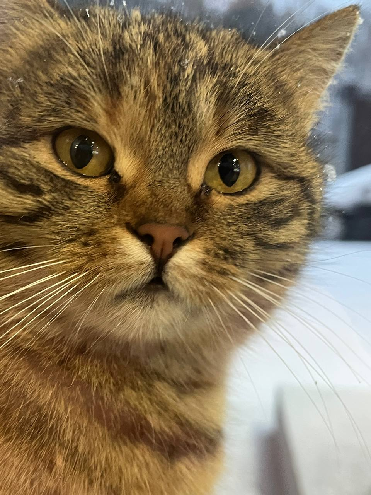

Здравствуйте! Меня зовут Дмитрий. Я рад представить свой проект.

О себе:
Мне 20 лет, я учусь в Государственном Университете по специальности "Прикладная Информатика". В своей учебе я стремлюсь к развитию в области технологий и программирования.

Области интересов:
1.Веб-разработка и дизайн
2.Мобильная разработка

Языки, которые я знаю:
1.Python
2.C++
3.Java

Языки, которые я изучаю:
PHP

Языки, которые хочу изучить:
Go

Как со мной связаться?
Instagram / Telegram: @MagaQqe
Email: playpplay8@gmail.com
